# ☀️ Solar Manager

## 📌 Explicação Detalhada do Código Feito:
Esse código é uma simulação de um **sistema de energia solar com gerenciamento de baterias**, que usa dados climáticos em tempo real (via API da Open-Meteo) para recomendar os melhores horários de carregamento, mantém um histórico em JSON com as informações de cada bateria cadastrada, e ainda faz um gráfico apartir do nome da bateria e a % final da bateria.

## ⚙️ Bibliotecas Utilizadas:
1. **Requests** - Para acessar a API Open-Meteo e pegar previsão do tempo (radiação solar, nuvens, etc.).
2. **Time** - Para simular o tempo passando durante o carregamento.
3. **Json** - Para salvar e ler histórico de baterias em arquivo.
4. **Matplotlib.pyplot** - Para gerar gráficos sobre o nível final das baterias.

## 🌤️ Coletas de Dados Clímaticos
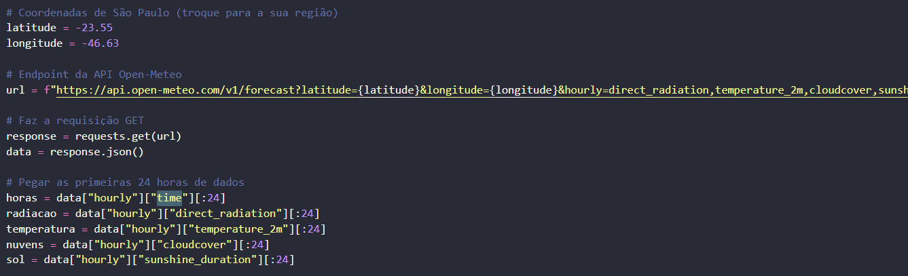

## 🔧 Funções Utilizidas no Sistema:
### 1ª Função:
### Funções utilizadas:
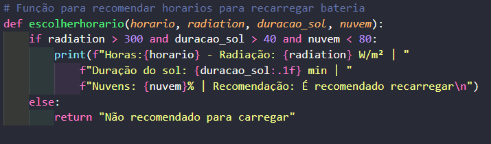

Função para **recomendar** o melhor horário para carregar a bateria apartir de um painel solar. 

Usando como parâmetro a **radiação solar** acima de 300, a **duração do sol** acima de 40 minutos e **porcentagem de nuvens** menor que 80.

### 2ª Função:
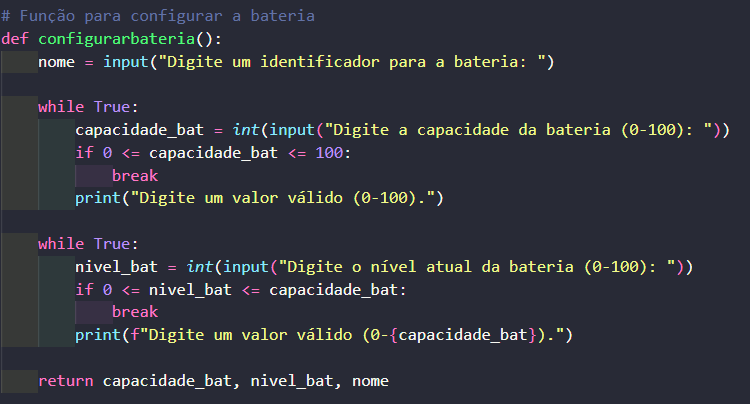

Essa função é feita para a **configuração** da bateria, pedindo seu **identificador**, a sua **capacidade máxima** e o **nível atual da bateria** em % que ela está no momento.

E no final da função ela retorna as 3 variáveis para uso futuro.

### 3ª e 4ª Função:


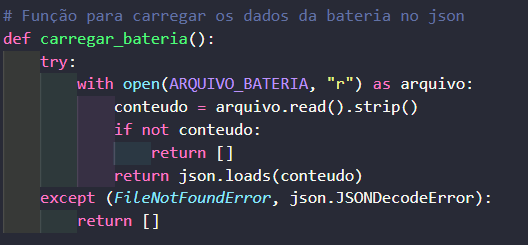

Essas duas funções se complementam, sendo a 3ª função **cri**a, caso nao tenha nenhum ainda, e **"escreve"** dentro do JSON a **configuração da bateria**.

E a 4ª função **"lê"** o JSON, mostrando a bateria que o usúario quiser, com sua devida configuração.

### 5ª Função:
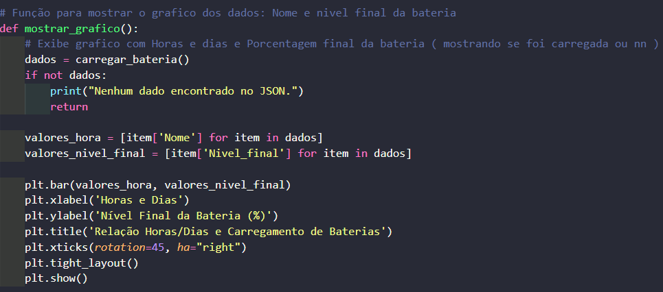

Essa função gera um **gráfico de barras**, usando o matplotlib, mostrando o nível final de cada bateria cadastrada.

- No eixo X: nomes ou identificadores das baterias.
- No eixo Y: nível final em %.
- Permite visualizar rapidamente quais baterias foram carregadas e em qual percentual terminaram.

### 6ª Função: Assistente Virtual
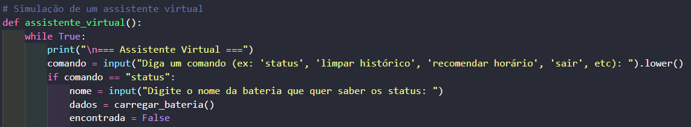
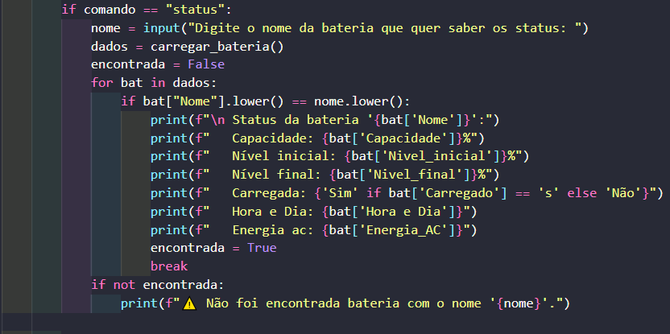
 
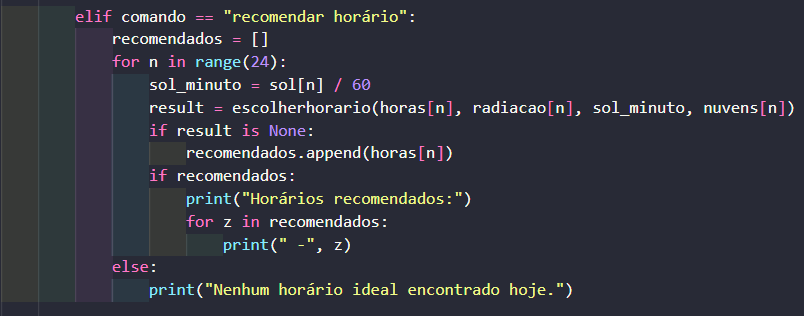

Uma simulação de **assistente virtual** é um modo interativo que permite ao usuário:

- Consultar o status de uma bateria específica;
- Limpar o histórico de baterias;
- Obter recomendações de horários ideais para recarregar;
- Encerrar o assistente e voltar ao menu principal.

Ele simula um chat de comandos dentro do programa, facilitando a interação.

### 7ª Função: Inversor DC -> AC
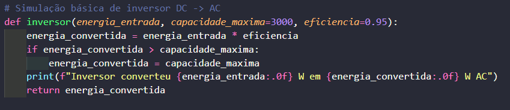

Simula a **conversão de energia da bateria (DC) para energia AC**, considerando:

- Eficiência do inversor (95% por padrão);
- Potência máxima do inversor (3000 W por padrão).

Permite calcular a energia disponível para uso em aparelhos elétricos após a conversão.

### 8ª Função: Menu Principal
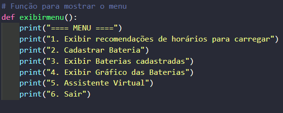

O programa apresenta um menu com as seguintes opções:

1. Exibir recomendações de horários para carregar
2. Cadastrar Bateria
3. Exibir Baterias cadastradas
4. Exibir Gráfico das Baterias
5. Assistente Virtual
6. Sair do programa

O usuário escolhe a opção desejada e o programa executa as funções correspondentes.

## Menu Principal
### Opção 1:
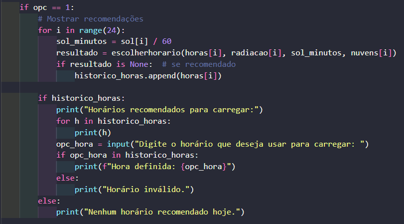

Se existirem horários ideais, o programa **lista todos eles e permite ao usuário escolher um horário específico para realizar o carregamento**.
Caso contrário, exibe uma mensagem informando que não há horários recomendados no dia.

### Opção 2:
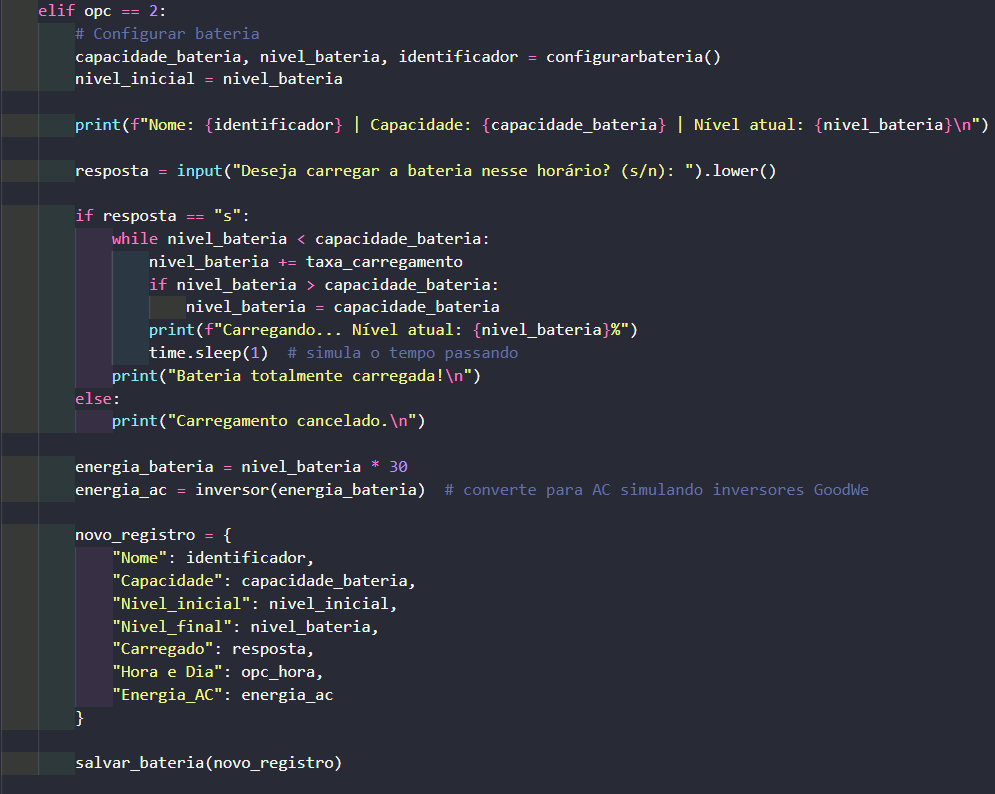

Essa opção utiliza a função configurarbateria(), que pede ao usuário:

- Nome (identificador da bateria)
- Capacidade máxima
- Nível atual da bateria

Após o cadastro, o sistema pergunta se deseja carregar a bateria:

- Se sim, simula o carregamento até a capacidade máxima, respeitando a taxa de carregamento.
- Se não, mantém o nível informado.

Por fim, o programa **converte a energia para AC com a função inversor() e salva o registro no arquivo JSON usando salvar_bateria().**

### Opção 3:


Essa opção mostra o **conteúdo atual do arquivo JSON**, listando todas as baterias cadastradas, com suas informações:

Nome (identificador)

- Capacidade
- Nível inicial
- Nível final
- Status de carregamento
- Horário em que foi registrada

Energia convertida em AC pelo inversor

### Opção 4:


Essa opção gera um **gráfico de barras** com o **nome das baterias no eixo X** e o **nível final de carga (%) no eixo Y**.
Facilita a visualização comparativa de quais baterias foram carregadas e até que ponto.

### Opção 5:


Ao escolher essa opção, o programa entra em um modo de **assistente virtual interativo**, que permite ao usuário:

- Consultar status detalhado de uma bateria específica;
- Limpar o histórico de baterias;
- Solicitar recomendações de horários ideais para recarga;

Encerrar o assistente e voltar ao menu principal.
Esse modo é como um **chat dentro do terminal**, tornando a interação mais dinâmica.

### Opção 6:
Essa opção encerra o programa com segurança, exibindo uma mensagem de saída.

## 🖥️ Demonstração do Resultado das Opções
### Opção 1:
```bash
--- Horários Recomendados para Carregar ---
Horas: 2025-09-25T10:00 - Radiação: 420.0 W/m² | Duração do sol: 60.00 min | Nuvens: 35% | Recomendação: É recomendado recarregar
Horas: 2025-09-25T11:00 - Radiação: 510.0 W/m² | Duração do sol: 60.00 min | Nuvens: 28% | Recomendação: É recomendado recarregar
Horas: 2025-09-25T12:00 - Radiação: 600.0 W/m² | Duração do sol: 60.00 min | Nuvens: 20% | Recomendação: É recomendado recarregar
```

Depois, o sistema pergunta se o usuário quer escolher um desses horários para carregar a bateria:

```bash
Deseja escolher um horário para carregar? (s/n): s
Digite a hora desejada (exemplo: 2025-09-25T11:00): 2025-09-25T11:00
```

O programa confirma a escolha:
```bash
Carregamento agendado para 2025-09-25T11:00.
```

### Opção 2:
O programa executa a função configurarbateria(), pedindo as informações:

```bash
Digite o nome da bateria: Bateria 1
Digite a capacidade máxima da bateria (%): 90
Digite o nível atual da bateria (%): 70
```

Depois pergunta se o usuário deseja carregar agora:

```bash
Deseja carregar a bateria agora? (s/n): s
```

O sistema simula o carregamento, mostra o progresso e converte para AC com a função inversor():

```bash
Carregando bateria...
Nível final: 90% (Bateria cheia)
Energia convertida em AC: 2565 Wh (eficiência 95%)
```

Por fim, salva no JSON usando salvar_bateria():

```bash
Registro salvo com sucesso no arquivo JSON.
```

### Opção 3:
O programa executa a função carregar_bateria(), que lê o arquivo JSON e exibe todas as baterias cadastradas:
--- Baterias Cadastradas ---

```bash
Nome: Bateria 1
Capacidade: 90%
Nível inicial: 70%
Nível final: 90%
Carregado: Sim
Horário registrado: 2025-09-25T11:00
Energia convertida em AC: 2565 Wh
```

Se não houver baterias cadastradas, o sistema mostra:
```bash
Nenhuma bateria cadastrada no momento.
```

### Opção 4:
Exemplo de gráfico das baterias:

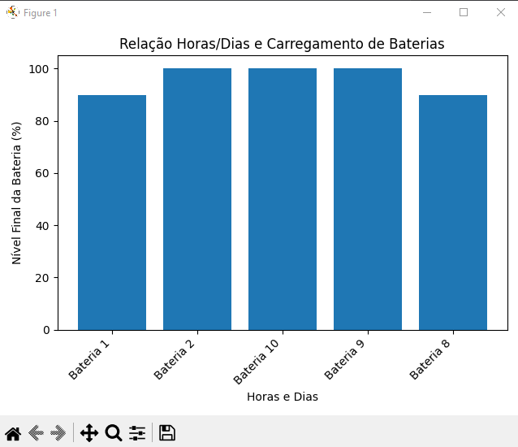

### Opção 5:
O programa executa a função assistente_virtual(), abrindo um modo simulando um "chat".

```bash
Chamando Assistente Virtual...
=== Assistente Virtual ===
Diga um comando (ex: 'status', 'limpar histórico', 'recomendar horário', 'sair', etc):
```
Usuário pede o status de uma bateria:
```bash
Digite o nome da bateria que quer saber os status: Bateria 1
```

```bash
Status da bateria 'Bateria 1':
   Capacidade: 100%
   Nível inicial: 50%
   Nível final: 90%
   Carregada: Sim
   Hora e Dia: 2025-09-25T11:00
   Energia ac: 2565 W
```

Usuário pede para limpar histórico:

```bash
limpar histórico
Tem certeza que deseja limpar o historico?(s/n): s
Historico apagado com sucesso!
```

Usuário pede recomendações de horário:

```bash
recomendar horário
Horas:2025-09-25T10:00 - Radiação: 420 W/m² | Duração do sol: 55.0 min | Nuvens: 30% | Recomendação: É recomendado recarregar

Horários recomendados:
 - 2025-09-25T10:00
 - 2025-09-25T11:00
```

Usuário digita sair:
```bash
sair
Desligando assistente virtual...
```

### Opção 6:
Caso o usúario aperto o número "6" aparece isso no terminal:
```bash
Saindo do programa...
```
e após isso, desliga o programa.

## 📑 Justificativa Técnica das Escolhas

- **Python** foi escolhido por sua facilidade em lidar com APIs, arquivos JSON e geração de gráficos.
- **API Open-Meteo** por ser gratuita e prática para coletar dados climáticos em tempo real.
- **JSON** como formato de armazenamento pela simplicidade e legibilidade.
- **Matplotlib** para visualização gráfica intuitiva dos resultados.

## 📊 Resultados e Dados Funcionais

- **Recomenda horários** de carregamento baseados em dados reais de radiação solar.
- Permite cadastrar múltiplas baterias e manter um histórico em JSON.
- **Gera gráficos comparativos** que ajudam na análise do desempenho das baterias.
- **Simula um assistente virtual interativo**, deixando a experiência mais prática.

## 🎓 Conexão com os conteúdos da disciplina

1. Energia Solar Fotovoltaica - O sistema simula o carregamento de baterias a partir da radiação solar, **demonstrando como a energia fotovoltaica pode ser aproveitada de forma eficiente**.
2. Eficiência Energética e Sustentabilidade - **A função do inversor DC → AC permite visualizar a eficiência de conversão energética** e entender perdas típicas de sistemas fotovoltaicos reais.
3. Integração de Tecnologia e Energias Renováveis - Uso de API de dados climáticos demonstra como tecnologia digital pode auxiliar em soluções energéticas renováveis, conectando ciência de dados e engenharia de energia.
   
## 👥 Integrantes 
1. Miguel Vanucci Delgado RM: 563491
2. Giovanna Fernandes Pereira RM: 565434
3. Igor Zuvela RM: 563602
4. João Vitor RM: 566541


